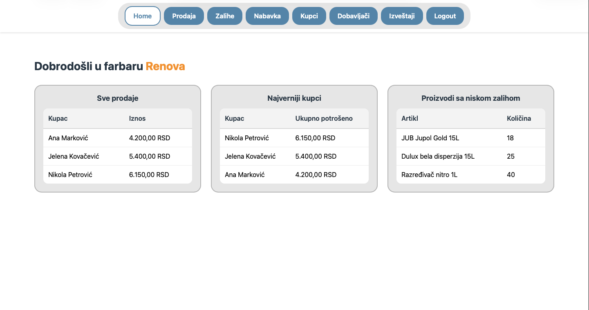
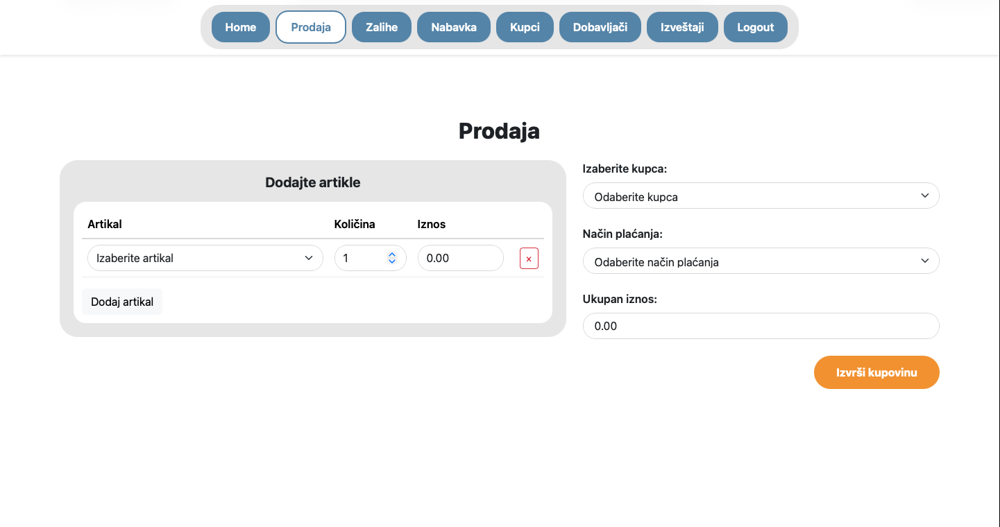
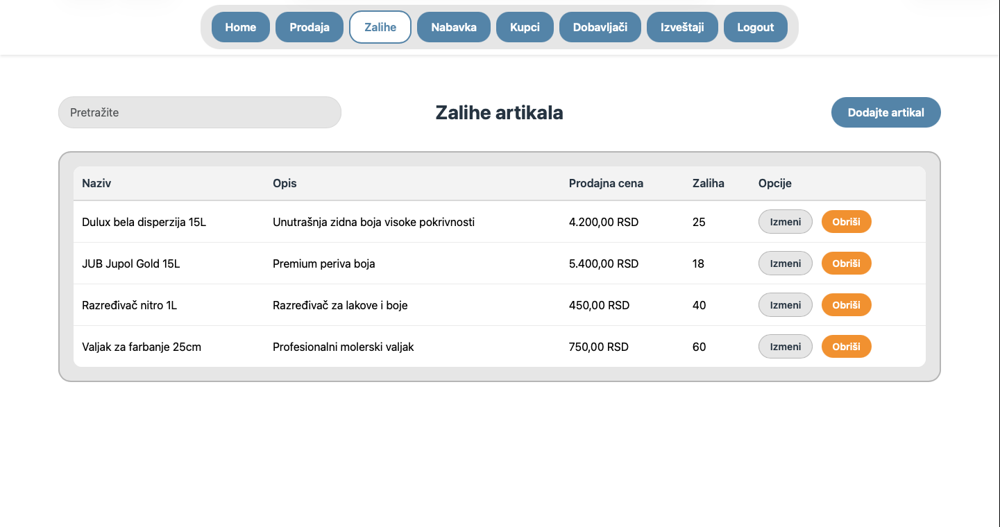
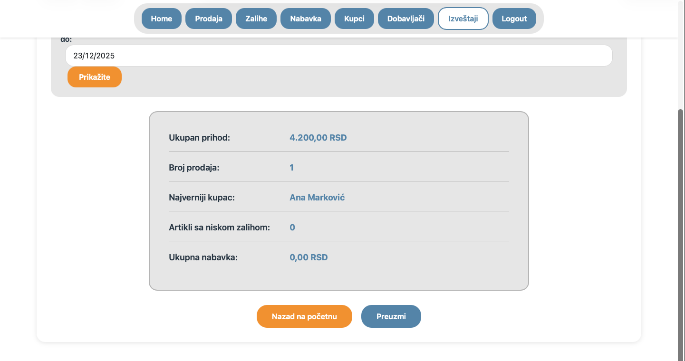
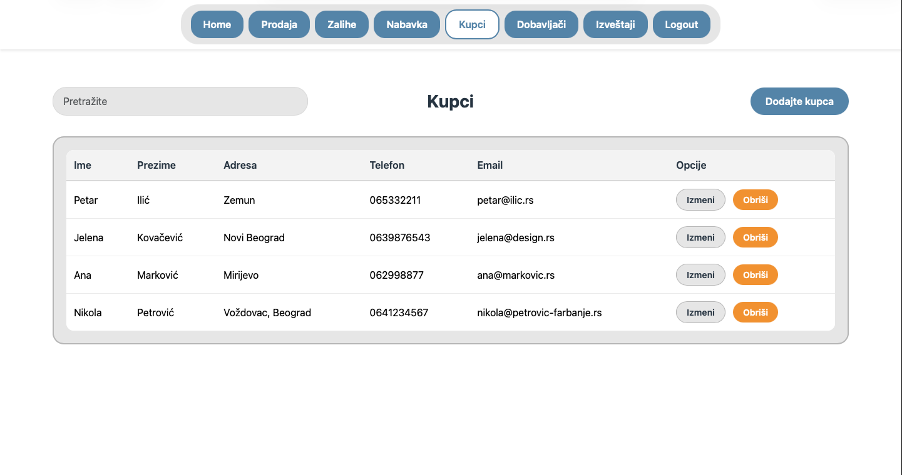
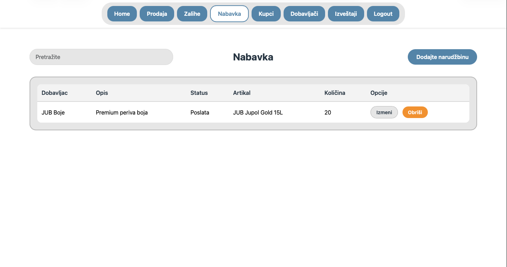

# Farbara Renova - Informacioni Sistem za Upravljanje Prodavnicom Boja

Aplikacija za upravljanje prodavnicom boja "Farbara Renova" koja omogućava upravljanje prodajom, nabavkom, artiklima, kupcima i dobavljačima, sa mogućnošću generisanja finansijskih izveštaja.

## 📋 Sadržaj

- [Način Implementacije](#način-implementacije)
- [GitHub Repozitorijum](#github-repozitorijum)
- [Blueprint Skripta](#blueprint-skripta)
- [GitHub Actions](#github-actions)
- [Screenshots](#screenshots)
- [Dokumentacija Fajlova](#dokumentacija-fajlova)
- [Dokumentacija Koda](#dokumentacija-koda)
- [Biblioteke i Komponente](#biblioteke-i-komponente)
- [Use Cases i Rute](#use-cases-i-rute)
- [Testovi](#testovi)

## 🛠️ Način Implementacije

Aplikacija je razvijena koristeći sledeće tehnologije i alate:

### Razvojni Okviri i Alati

- **Laravel 12** - PHP web framework za backend logiku
- **Laravel Breeze** - Autentifikacija i osnovni UI scaffolding
- **Laravel Blueprint** - Generator koda za modele, kontrolere, migracije i seedere
- **Laravel Pint** - Code style fixer (PSR-12 standard)
- **PHPUnit** - Framework za unit i feature testiranje
- **GitHub Actions** - CI/CD pipeline za automatsko testiranje i code style proveru

### Frontend Tehnologije

- **Tailwind CSS** - Utility-first CSS framework za stilizovanje
- **Alpine.js** - Lagana JavaScript biblioteka za interaktivne komponente
- **Vite** - Build tool za frontend assets
- **Bootstrap 5** - CSS framework (korišćen za neke komponente)

### Biblioteke

- **Carbon** - PHP biblioteka za rad sa datumima
- **Faker** - Generisanje test podataka
- **Axios** - HTTP klijent za AJAX zahteve

### Baza Podataka

- **SQLite** - Za development i testiranje
- **MySQL/PostgreSQL** - Podržano za production (konfiguracija u `.env`)

## 🔗 GitHub Repozitorijum

[Link ka GitHub repozitorijumu](https://github.com/lucwii/StoreProject)


## 📝 Blueprint Skripta

Blueprint skripta (`draft.yaml`) je korišćena za generisanje osnovne strukture aplikacije. Sadržaj skripte:

```yaml
models:
  Uloga:
    naziv: string
    relationships:
      hasMany: Korisnik

  Kupac:
    ime: string
    prezime: string
    telefon: string
    email: string:nullable
    adresa: string:nullable
    relationships:
      hasMany: Prodaja

  Dobavljac:
    naziv: string
    kontakt_osoba: string
    telefon: string
    email: string
    relationships:
      hasMany:
        - Artikal
        - Narudzbina

  Artikal:
    naziv: string
    opis: text
    nabavna_cena: decimal:8,2
    prodajna_cena: decimal:8,2
    kolicina_na_stanju: integer
    dobavljac_id: id
    relationships:
      belongsTo: Dobavljac
      hasMany:
        - StavkaProdaje
        - StavkaNarudzbine

  Prodaja:
    datum: date
    ukupan_iznos: decimal:10,2
    nacin_placanja: string
    kupac_id: id
    user_id: id
    relationships:
      belongsTo:
        - Kupac
        - User
      hasMany: StavkaProdaje

  StavkaProdaje:
    prodaja_id: id
    artikal_id: id
    kolicina: integer
    cena: decimal:8,2
    relationships:
      belongsTo:
        - Prodaja
        - Artikal

  Narudzbina:
    datum: date
    status: string
    dobavljac_id: id
    user_id: id
    relationships:
      belongsTo:
        - Dobavljac
        - User
      hasMany: StavkaNarudzbine

  StavkaNarudzbine:
    narudzbina_id: id
    artikal_id: id
    kolicina: integer
    relationships:
      belongsTo:
        - Narudzbina
        - Artikal

controllers:
  Kupac:
    resource: web

  Dobavljac:
    resource: web

  Artikal:
    resource: web

  Prodaja:
    resource: web

  Narudzbina:
    resource: web

seeders:
  Uloga
  Kupac
  Dobavljac
  Artikal
```

Blueprint je pokrenut komandom:
```bash
php artisan blueprint:build draft.yaml
```

## ⚙️ GitHub Actions

GitHub Actions workflow fajl (`.github/workflows/testovi.yml`) automatski pokreće testove i Pint proveru na svaki push i pull request:

```yaml
name: Laravel CI/CD

on:
  push:
    branches: 
      - '*'
  pull_request:
    branches: 
      - '*'

jobs:
  build:
    runs-on: ubuntu-latest
    steps:
      # Checkout repozitorijuma
      - name: Proveru koda
        uses: actions/checkout@v4

      # Podesavanje PHP
      - name: Podesavanje PHP okruženja
        uses: shivammathur/setup-php@v2
        with:
          php-version: '8.4'
          extensions: mbstring, bcmath, pdo, pdo_mysql, json, curl, sqlite3
          coverage: none

      # Kes Composer zavisnosti
      - name: Kes composer zavisnosti
        uses: actions/cache@v4
        with:
          path: vendor
          key: ${{ runner.os }}-composer-${{ hashFiles('**/composer.lock') }}
          restore-keys: |
            ${{ runner.os }}-composer-

      # Instalacija Composer paketa
      - name: Instalacija Composer paketa
        run: composer install --prefer-dist --no-progress --no-interaction

      # Kopiranje .env fajla i generisanje aplikacionog ključa
      - name: Setup environment
        run: |
          cp .env.example .env
          php artisan key:generate

      # Konfigurisanje SQLite baze podataka 
      - name: Configure SQLite database
        run: |
          sed -i 's/DB_CONNECTION=.*/DB_CONNECTION=sqlite/' .env
          sed -i 's/DB_DATABASE=.*/DB_DATABASE=:memory:/' .env

      # Pokretanje code style provere sa Pint
      - name: Pokretanje PHP code style provere sa Pintom
        run: ./vendor/bin/pint --test

      # Pokretanje migracija i seeding baze podataka
      - name: Pokretanje migracija
        run: php artisan migrate --force

      # Pokretanje Laravel testova
      - name: Pokretanje Laravel testova
        run: php artisan test

      # Završetak posla
      - name: Uspesno završavanje posla
        run: echo "✅ Laravel CI posao je uspešno završen!"
```

## 📸 Screenshots

### Dashboard

*Prikaz dashboard-a sa pregledom prodaja, najvernijih kupaca i artikala sa niskom zalihom*

### Kreiranje Prodaje

*Forma za kreiranje nove prodaje sa dinamičkim dodavanjem artikala*

### Upravljanje Artiklima

*Lista svih artikala sa mogućnošću pretrage, dodavanja, izmene i brisanja*

### Finansijski Izveštaji

*Stranica sa finansijskim izveštajima dostupna samo admin korisnicima*

### Upravljanje Kupcima

*Lista svih kupaca sa CRUD operacijama*

### Upravljanje Narudžbinama

*Lista narudžbina sa statusom i detaljima*

## 📁 Dokumentacija Fajlova

### Modeli

#### `app/Models/Artikal.php`
- **Način kreiranja:** Generisan Blueprint alatom, ručno dopunjen
- **Svrha:** Model za artikle/proizvode u prodavnici
- **Atributi:** `naziv`, `opis`, `nabavna_cena`, `prodajna_cena`, `kolicina_na_stanju`, `dobavljac_id`
- **Relacije:** `belongsTo(Dobavljac)`, `hasMany(StavkaProdaje)`, `hasMany(StavkaNarudzbine)`

#### `app/Models/Kupac.php`
- **Način kreiranja:** Generisan Blueprint alatom
- **Svrha:** Model za kupce/prodavnice
- **Atributi:** `ime`, `prezime`, `telefon`, `email`, `adresa`
- **Relacije:** `hasMany(Prodaja)`

#### `app/Models/Dobavljac.php`
- **Način kreiranja:** Generisan Blueprint alatom
- **Svrha:** Model za dobavljače
- **Atributi:** `naziv`, `kontakt_osoba`, `telefon`, `email`
- **Relacije:** `hasMany(Artikal)`, `hasMany(Narudzbina)`

#### `app/Models/Narudzbina.php`
- **Način kreiranja:** Generisan Blueprint alatom
- **Svrha:** Model za narudžbine dobavljačima
- **Atributi:** `datum`, `status`, `dobavljac_id`, `user_id`
- **Relacije:** `belongsTo(Dobavljac)`, `belongsTo(User)`, `hasMany(StavkaNarudzbine)`

#### `app/Models/Prodaja.php`
- **Način kreiranja:** Generisan Blueprint alatom, ručno dopunjen
- **Svrha:** Model za prodaje
- **Atributi:** `datum`, `ukupan_iznos`, `nacin_placanja`, `kupac_id`, `user_id`
- **Relacije:** `belongsTo(Kupac)`, `belongsTo(User)`, `hasMany(StavkaProdaje)`

#### `app/Models/StavkaProdaje.php`
- **Način kreiranja:** Generisan Blueprint alatom
- **Svrha:** Model za stavke prodaje (pivot tabela)
- **Atributi:** `prodaja_id`, `artikal_id`, `kolicina`, `cena`
- **Relacije:** `belongsTo(Prodaja)`, `belongsTo(Artikal)`

#### `app/Models/StavkaNarudzbine.php`
- **Način kreiranja:** Generisan Blueprint alatom
- **Svrha:** Model za stavke narudžbine (pivot tabela)
- **Atributi:** `narudzbina_id`, `artikal_id`, `kolicina`
- **Relacije:** `belongsTo(Narudzbina)`, `belongsTo(Artikal)`

#### `app/Models/Uloga.php`
- **Način kreiranja:** Ručno kreiran
- **Svrha:** Model za uloge korisnika (Admin, Prodavac)
- **Atributi:** `naziv`
- **Relacije:** `hasMany(User)`

#### `app/Models/User.php`
- **Način kreiranja:** Generisan Laravel Breeze alatom
- **Svrha:** Model za korisnike sistema
- **Atributi:** Standardni Laravel User atributi + `uloga_id`
- **Relacije:** `belongsTo(Uloga)`, `hasMany(Prodaja)`, `hasMany(Narudzbina)`
- **Metode:** `isAdmin()` - provera da li je korisnik admin

### Kontroleri

#### `app/Http/Controllers/ArtikalController.php`
- **Način kreiranja:** Generisan Blueprint alatom, ručno dopunjen
- **Svrha:** Resource kontroler za CRUD operacije nad artiklima
- **Metode:**
  - `index()` - prikaz liste artikala sa pretragom
  - `create()` - prikaz forme za dodavanje artikla
  - `store()` - čuvanje novog artikla
  - `edit()` - prikaz forme za izmenu artikla
  - `update()` - ažuriranje artikla
  - `destroy()` - brisanje artikla

#### `app/Http/Controllers/KupacController.php`
- **Način kreiranja:** Generisan Blueprint alatom, ručno dopunjen
- **Svrha:** Resource kontroler za CRUD operacije nad kupcima
- **Metode:** Standardne resource metode (index, create, store, edit, update, destroy)

#### `app/Http/Controllers/DobavljacController.php`
- **Način kreiranja:** Generisan Blueprint alatom, ručno dopunjen
- **Svrha:** Resource kontroler za CRUD operacije nad dobavljačima
- **Metode:** Standardne resource metode

#### `app/Http/Controllers/NarudzbinaController.php`
- **Način kreiranja:** Generisan Blueprint alatom, ručno dopunjen
- **Svrha:** Resource kontroler za CRUD operacije nad narudžbinama
- **Metode:** Standardne resource metode + logika za upravljanje stavkama narudžbine

#### `app/Http/Controllers/ProdajaController.php`
- **Način kreiranja:** Generisan Blueprint alatom, ručno dopunjen
- **Svrha:** Resource kontroler za CRUD operacije nad prodajama
- **Metode:**
  - `create()` - prikaz forme za kreiranje prodaje sa dinamičkim dodavanjem artikala
  - `store()` - čuvanje prodaje sa automatskim smanjenjem zaliha artikala
  - Standardne resource metode za pregled, izmenu i brisanje

#### `app/Http/Controllers/DashboardController.php`
- **Način kreiranja:** Ručno kreiran
- **Svrha:** Kontroler za dashboard stranicu
- **Metode:**
  - `index()` - prikaz dashboard-a sa statistikama (sve prodaje, najverniji kupci, artikli sa niskom zalihom)

#### `app/Http/Controllers/IzvestajController.php`
- **Način kreiranja:** Ručno kreiran
- **Svrha:** Kontroler za finansijske izveštaje (samo za admin korisnike)
- **Metode:**
  - `index()` - prikaz izveštaja za odabrani period (ukupan prihod, broj prodaja, najverniji kupac, artikli sa niskom zalihom, ukupna nabavka)
  - Provera admin uloge pre pristupa

### Request Klase (Validacija)

Sve request klase su kreirane ručno za validaciju podataka:

- `app/Http/Requests/ArtikalStoreRequest.php` - Validacija za dodavanje artikla
- `app/Http/Requests/ArtikalUpdateRequest.php` - Validacija za izmenu artikla
- `app/Http/Requests/KupacStoreRequest.php` - Validacija za dodavanje kupca
- `app/Http/Requests/KupacUpdateRequest.php` - Validacija za izmenu kupca
- `app/Http/Requests/DobavljacStoreRequest.php` - Validacija za dodavanje dobavljača
- `app/Http/Requests/DobavljacUpdateRequest.php` - Validacija za izmenu dobavljača
- `app/Http/Requests/NarudzbinaStoreRequest.php` - Validacija za dodavanje narudžbine
- `app/Http/Requests/NarudzbinaUpdateRequest.php` - Validacija za izmenu narudžbine
- `app/Http/Requests/ProdajaStoreRequest.php` - Validacija za dodavanje prodaje
- `app/Http/Requests/ProdajaUpdateRequest.php` - Validacija za izmenu prodaje

### Migracije

Sve migracije su generisane Blueprint alatom:

- `database/migrations/0000_12_31_235959_create_ulogas_table.php` - Kreiranje tabele uloga
- `database/migrations/0001_01_01_000000_create_users_table.php` - Kreiranje tabele korisnika (Laravel Breeze)
- `database/migrations/2025_12_22_150545_create_kupacs_table.php` - Kreiranje tabele kupaca
- `database/migrations/2025_12_22_150546_create_dobavljacs_table.php` - Kreiranje tabele dobavljača
- `database/migrations/2025_12_22_150547_create_artikals_table.php` - Kreiranje tabele artikala
- `database/migrations/2025_12_22_150548_create_prodajas_table.php` - Kreiranje tabele prodaja
- `database/migrations/2025_12_22_150549_create_stavka_prodajes_table.php` - Kreiranje tabele stavki prodaje
- `database/migrations/2025_12_22_150550_create_narudzbinas_table.php` - Kreiranje tabele narudžbina
- `database/migrations/2025_12_22_150551_create_stavka_narudzbines_table.php` - Kreiranje tabele stavki narudžbine

### Seederi

Svi seederi su ručno generisani i dopunjeni:

- `database/seeders/UlogaSeeder.php` - Seeding uloga (Admin, Prodavac)
- `database/seeders/UserSeeder.php` - Seeding test korisnika
- `database/seeders/KupacSeeder.php` - Seeding test kupaca
- `database/seeders/DobavljacSeeder.php` - Seeding test dobavljača
- `database/seeders/ArtikalSeeder.php` - Seeding test artikala
- `database/seeders/ProdajaSeeder.php` - Seeding test prodaja
- `database/seeders/NarudzbinaSeeder.php` - Seeding test narudžbina
- `database/seeders/StavkaProdajeSeeder.php` - Seeding stavki prodaje
- `database/seeders/StavkaNarudzbineSeeder.php` - Seeding stavki narudžbine

### View Fajlovi

Svi view fajlovi su kreirani ručno koristeći Blade templating:

#### Layout Fajlovi
- `resources/views/layouts/public.blade.php` - Glavni layout sa top navigacijom
- `resources/views/components/topnav.blade.php` - Top navigacija komponenta

#### CRUD View Fajlovi
- `resources/views/artikal/index.blade.php` - Lista artikala
- `resources/views/artikal/create.blade.php` - Forma za dodavanje artikla
- `resources/views/artikal/edit.blade.php` - Forma za izmenu artikla
- `resources/views/kupac/index.blade.php` - Lista kupaca
- `resources/views/kupac/create.blade.php` - Forma za dodavanje kupca
- `resources/views/kupac/edit.blade.php` - Forma za izmenu kupca
- `resources/views/dobavljac/index.blade.php` - Lista dobavljača
- `resources/views/dobavljac/create.blade.php` - Forma za dodavanje dobavljača
- `resources/views/dobavljac/edit.blade.php` - Forma za izmenu dobavljača
- `resources/views/narudzbina/index.blade.php` - Lista narudžbina
- `resources/views/narudzbina/create.blade.php` - Forma za dodavanje narudžbine
- `resources/views/narudzbina/edit.blade.php` - Forma za izmenu narudžbine
- `resources/views/prodaja/create.blade.php` - Forma za kreiranje prodaje sa dinamičkim dodavanjem artikala

#### Specijalni View Fajlovi
- `resources/views/dashboard.blade.php` - Dashboard sa statistikama
- `resources/views/izvestaj/index.blade.php` - Stranica sa finansijskim izveštajima

## 💻 Dokumentacija Koda

### Ključne Funkcionalnosti

#### 1. Dinamičko Dodavanje Artikala u Prodaju

**Lokacija:** `resources/views/prodaja/create.blade.php`, `resources/js/app.js`

**Svrha:** Omogućava korisniku da dinamički dodaje i uklanja artikle iz prodaje pre čuvanja.

**Implementacija:**
- JavaScript funkcije za dodavanje/uklanjanje redova u tabeli
- Automatsko računanje ukupnog iznosa na osnovu količine i cene artikala
- Validacija da su sva polja popunjena pre slanja forme

#### 2. Automatsko Smanjenje Zaliha pri Prodaji

**Lokacija:** `app/Http/Controllers/ProdajaController.php` - `store()` metoda

**Svrha:** Automatski smanjuje količinu artikala na stanju nakon uspešne prodaje.

**Implementacija:**
```php
foreach ($validated['artikli'] as $artikalData) {
    $artikal = Artikal::find($artikalData['artikal_id']);
    $artikal->kolicina_na_stanju -= $artikalData['kolicina'];
    $artikal->save();
}
```

#### 3. Pretraga i Filtriranje

**Lokacija:** Kontroleri (`ArtikalController`, `KupacController`, `DobavljacController`, `NarudzbinaController`)

**Svrha:** Omogućava pretragu podataka po različitim kriterijumima.

**Implementacija:**
- `index()` metode u kontrolerima primaju `search` parametar
- Eloquent `where` klauzule za filtriranje po različitim poljima
- Case-insensitive pretraga

#### 4. Role-Based Access Control (RBAC)

**Lokacija:** `app/Models/User.php` - `isAdmin()` metoda, `app/Http/Controllers/IzvestajController.php`

**Svrha:** Ograničava pristup određenim stranicama samo admin korisnicima.

**Implementacija:**
- `User` model ima `isAdmin()` metodu koja proverava `uloga_id`
- `IzvestajController` proverava admin ulogu pre pristupa
- Top navigacija prikazuje "Izveštaji" link samo admin korisnicima

#### 5. Dashboard Statistike

**Lokacija:** `app/Http/Controllers/DashboardController.php`

**Svrha:** Prikazuje ključne poslovne metrike na dashboard-u.

**Implementacija:**
- **Sve prodaje:** Lista svih prodaja sa kupcem i iznosom, sortirano po datumu
- **Najverniji kupci:** Top 3 kupca sa najvećom ukupnom potrošnjom
- **Artikli sa niskom zalihom:** Top 3 artikla sa najmanjom zalihom

#### 6. Finansijski Izveštaji

**Lokacija:** `app/Http/Controllers/IzvestajController.php`

**Svrha:** Generiše finansijske izveštaje za odabrani vremenski period.

**Implementacija:**
- **Ukupan prihod:** Suma svih prodaja u periodu
- **Broj prodaja:** Broj prodaja u periodu
- **Najverniji kupac:** Kupac sa najviše prodaja u periodu
- **Artikli sa niskom zalihom:** Broj artikala sa zalihom < 10
- **Ukupna nabavka:** Suma svih narudžbina u periodu (računato na osnovu stavki)

#### 7. Validacija Formi

**Lokacija:** `app/Http/Requests/*`

**Svrha:** Validacija podataka pre čuvanja u bazu.

**Ključne validacije:**
- Cene moraju biti numeričke vrednosti (min: 0, max: 999999.99)
- Telefoni moraju biti u validnom formatu (regex: `/^[0-9+\-\s()]+$/`)
- Email adrese moraju biti u validnom formatu
- Obavezna polja su proverena
- Foreign key validacija (`exists` pravila)

#### 8. Sticky Navigation Bar

**Lokacija:** `resources/views/components/topnav.blade.php`, `resources/views/layouts/public.blade.php`

**Svrha:** Navigacija koja ostaje vidljiva na vrhu stranice tokom skrolovanja.

**Implementacija:**
- CSS `position: fixed` za top navigaciju
- `padding-top` na body elementu da se sadržaj ne sakrije iza navigacije
- Z-index za pravilno slaganje elemenata

## 📚 Biblioteke i Komponente

### Backend Biblioteke

#### Laravel Framework (v12)
- **Korišćeno za:** Osnovni framework funkcionalnosti
- **Lokacija:** Ceo projekat
- **Svrha:** Routing, ORM, middleware, validacija, autentifikacija

#### Laravel Breeze
- **Korišćeno za:** Autentifikaciju i osnovni UI scaffolding
- **Lokacija:** `routes/auth.php`, `app/Http/Controllers/Auth/*`, `resources/views/auth/*`
- **Svrha:** Login, registracija, password reset funkcionalnosti

#### Carbon
- **Korišćeno za:** Rad sa datumima
- **Lokacija:** `app/Http/Controllers/IzvestajController.php`
- **Svrha:** Manipulacija datumima za izveštaje (npr. `Carbon::now()->subMonth()`)

#### Laravel Pint
- **Korišćeno za:** Code style proveru i formatiranje
- **Lokacija:** CI/CD pipeline (`.github/workflows/testovi.yml`)
- **Svrha:** Automatska provera PSR-12 standarda

### Frontend Biblioteke

#### Tailwind CSS (v3.1.0)
- **Korišćeno za:** Stilizovanje komponenti
- **Lokacija:** `resources/css/app.css`, svi Blade view fajlovi
- **Svrha:** Utility-first CSS za brzo stilizovanje

#### Bootstrap 5
- **Korišćeno za:** Grid sistem i neke komponente (tabele, dugmad)
- **Lokacija:** Blade view fajlovi
- **Svrha:** Responsive layout i osnovne UI komponente

#### Alpine.js (v3.4.2)
- **Korišćeno za:** Interaktivne komponente
- **Lokacija:** Blade view fajlovi
- **Svrha:** Lagana JavaScript funkcionalnost bez jQuery zavisnosti

#### Vite (v7.0.7)
- **Korišćeno za:** Build proces za frontend assets
- **Lokacija:** `vite.config.js`
- **Svrha:** Kompajliranje CSS i JavaScript fajlova

#### Axios (v1.11.0)
- **Korišćeno za:** HTTP zahtevi
- **Lokacija:** `resources/js/bootstrap.js`
- **Svrha:** AJAX komunikacija sa backend-om (ako je potrebno)

### Development Alati

#### Laravel Blueprint
- **Korišćeno za:** Generisanje koda
- **Lokacija:** `draft.yaml`
- **Svrha:** Automatsko generisanje modela, kontrolera, migracija, seedera

#### PHPUnit
- **Korišćeno za:** Testiranje
- **Lokacija:** `tests/` direktorijum
- **Svrha:** Unit i feature testovi

## 🎯 Use Cases i Rute

### Use Case 1: Kreiranje Prodaje

**Ruta:** `POST /prodajas` (resource ruta)

**Opis:** Prodavac kreira novu prodaju birajući artikle, kupca i način plaćanja. Sistem automatski računa ukupan iznos i smanjuje zalihe artikala.

**Implementacija:**
- `GET /prodajas/create` - Prikaz forme za kreiranje prodaje
- `POST /prodajas` - Čuvanje prodaje
- Kontroler: `ProdajaController@create`, `ProdajaController@store`
- View: `resources/views/prodaja/create.blade.php`

**Test:** `tests/Feature/ProdajaUseCaseTest.php`

### Use Case 2: Kreiranje Narudžbine Dobavljaču

**Ruta:** `POST /narudzbinas` (resource ruta)

**Opis:** Menadžer kreira narudžbinu dobavljaču birajući artikle i količine. Sistem čuva narudžbinu sa statusom.

**Implementacija:**
- `GET /narudzbinas/create` - Prikaz forme za kreiranje narudžbine
- `POST /narudzbinas` - Čuvanje narudžbine
- Kontroler: `NarudzbinaController@create`, `NarudzbinaController@store`
- View: `resources/views/narudzbina/create.blade.php`

**Test:** `tests/Feature/NarudzbinaUseCaseTest.php`

### Use Case 3: Upravljanje Kupcima

**Ruta:** `GET /kupacs`, `POST /kupacs`, `PUT /kupacs/{id}`, `DELETE /kupacs/{id}` (resource rute)

**Opis:** Prodavac može da pregleda, dodaje, menja i briše kupce.

**Implementacija:**
- Resource rute za CRUD operacije
- Kontroler: `KupacController`
- Views: `resources/views/kupac/index.blade.php`, `create.blade.php`, `edit.blade.php`

**Test:** `tests/Feature/KupciUseCaseTest.php`

### Use Case 4: Pregled Finansijskih Izveštaja

**Ruta:** `GET /izvestaji`

**Opis:** Admin korisnik pregleda finansijske izveštaje za odabrani vremenski period.

**Implementacija:**
- `GET /izvestaji` - Prikaz izveštaja sa opcionim parametrima `od_datum` i `do_datum`
- Kontroler: `IzvestajController@index`
- View: `resources/views/izvestaj/index.blade.php`
- Middleware: Provera admin uloge u kontroleru

**Test:** `tests/Feature/IzvestajiUseCaseTest.php`

### Sve Rute

```php
// Public rute
Route::get('/', function () {
    return redirect()->route('login');
});

// Autentifikovane rute
Route::middleware('auth')->group(function () {
    // Dashboard
    Route::get('/dashboard', [DashboardController::class, 'index'])->name('dashboard');
    
    // Resource rute
    Route::resource('kupacs', KupacController::class);
    Route::resource('dobavljacs', DobavljacController::class);
    Route::resource('artikals', ArtikalController::class);
    Route::resource('prodajas', ProdajaController::class);
    Route::resource('narudzbinas', NarudzbinaController::class);
    
    // Specijalne rute
    Route::get('/prodaja', [ProdajaController::class, 'create'])->name('prodajas.create');
    Route::post('/prodaja', [ProdajaController::class, 'store'])->name('prodajas.store');
    
    // Admin rute
    Route::get('/izvestaji', [IzvestajController::class, 'index'])->name('izvestaji.index');
});
```

## 🧪 Testovi

### Feature Testovi

#### `tests/Feature/ProdajaUseCaseTest.php`
- **Svrha:** Testiranje funkcionalnosti kreiranja prodaje
- **Testovi:**
  - `prodavac_moze_da_otvori_stranicu_za_kreiranje_prodaje()` - Provera da prodavac može da pristupi formi
  - `prodavac_moze_da_kreira_prodaju()` - Provera uspešnog kreiranja prodaje
  - `prodaja_ne_moze_bez_kupca()` - Provera validacije da kupac mora biti izabran

#### `tests/Feature/NarudzbinaUseCaseTest.php`
- **Svrha:** Testiranje funkcionalnosti kreiranja narudžbine
- **Testovi:**
  - `menadzer_otvara_listu_nabavki()` - Provera pristupa listi narudžbina
  - `menadzer_otvara_formu_za_novu_narudzbinu()` - Provera pristupa formi
  - `menadzer_kreira_narudzbinu()` - Provera uspešnog kreiranja narudžbine

#### `tests/Feature/KupciUseCaseTest.php`
- **Svrha:** Testiranje funkcionalnosti upravljanja kupcima
- **Testovi:**
  - `prodavac_otvara_listu_kupaca()` - Provera pristupa listi kupaca
  - `prodavac_dodaje_kupca()` - Provera dodavanja novog kupca
  - `prodavac_azurira_postojeceg_kupca()` - Provera ažuriranja postojećeg kupca

#### `tests/Feature/IzvestajiUseCaseTest.php`
- **Svrha:** Testiranje funkcionalnosti finansijskih izveštaja
- **Testovi:**
  - `menadzer_otvara_stranicu_izvestaja()` - Provera pristupa stranici izveštaja
  - `menadzer_gleda_izvestaj_sa_podacima_za_period()` - Provera prikaza izveštaja sa podacima za period

### Unit Testovi

#### `tests/Unit/ExampleTest.php`
- **Svrha:** Osnovni unit test za proveru da test okruženje radi

### Pokretanje Testova

```bash
# Pokretanje svih testova
php artisan test

# Pokretanje specifičnog testa
php artisan test --filter=ProdajaUseCaseTest

# Pokretanje sa coverage-om
php artisan test --coverage
```

## 📦 Instalacija i Pokretanje

### Preduslovi

- PHP 8.2 ili noviji
- Composer
- Node.js i npm
- SQLite (za development) ili MySQL/PostgreSQL (za production)

### Instalacija

```bash
# Kloniranje repozitorijuma
git clone https://github.com/your-username/StoreProject.git
cd StoreProject

# Instalacija PHP zavisnosti
composer install

# Instalacija Node.js zavisnosti
npm install

# Kopiranje .env fajla
cp .env.example .env

# Generisanje aplikacionog ključa
php artisan key:generate

# Pokretanje migracija i seedera
php artisan migrate --seed

# Build frontend assets
npm run build

# Pokretanje development servera
php artisan serve
```

Aplikacija će biti dostupna na `http://localhost:8000`

### Default Korisnici

Nakon pokretanja seedera, dostupni su sledeći test korisnici:

- **Admin:** email: `luka@farbara.rs`, password: `password`
- **Prodavac:** email: `andrija@farbara.rs`, password: `password`

## 📄 Licenca

MIT License

## 👥 Autor

Luka Milanović

---
